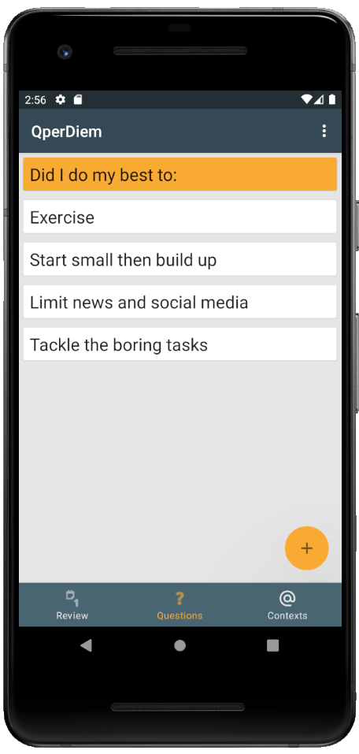
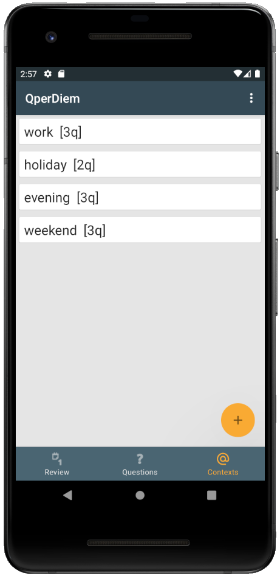
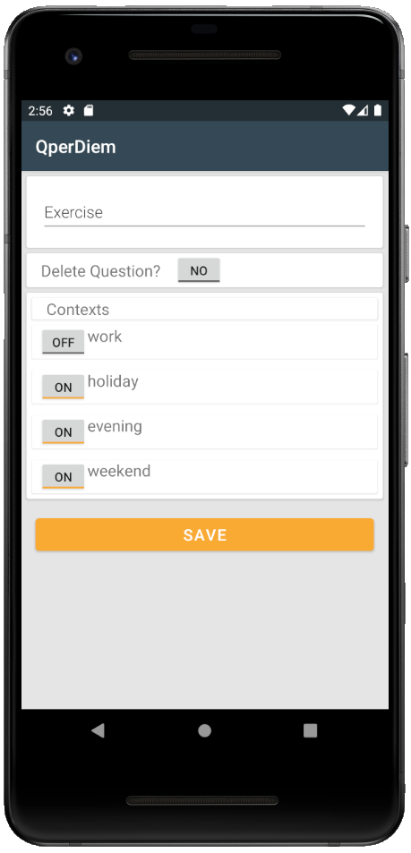

# QperDiem
A daily questions android app. Using native Java, Android Room to link to SQLite backend. IDE Android Studio.

## Brief
> Setting and asking daily questions is a method popularised by Marshall Goldsmith. In essence you write down a list of questions for yourself starting with the phrase “did i do my best to…”, you refer to them throughout the day as a reminder and at the end of each day you score each one based on the effort you put into it.
I have set out to develop this app to help with this. 

| Questions Page | Edit Questions | Contexts Page |
| :---:         |     :---:      |          :---: |
|    |      |     |

## Status
> The project is still a work in progress, users can add questions and contexts and link questions to contexts

## Future/Current Development
* Allow user to review and rate their questions on a daily basis 
* Allow user to view previous rating. 
* Display of an average rating for the day
* A daily notification for a review
* A periodic notification dependent on the selected context. 
* Method to sync data to a website while maintaining functionality offline.

## Use
> The app is not ready for use yet, but you can view the funcationally using the steps below: 
1. Install android studio 
    * You will have to install an emulator in android studio, this will show up in the setup
2. Download the project files from github
3. Open the file with android studio. 
4. Run the app folder with your emulated device 
5. The emulator should pop up and you can navigate it with the mouse.

